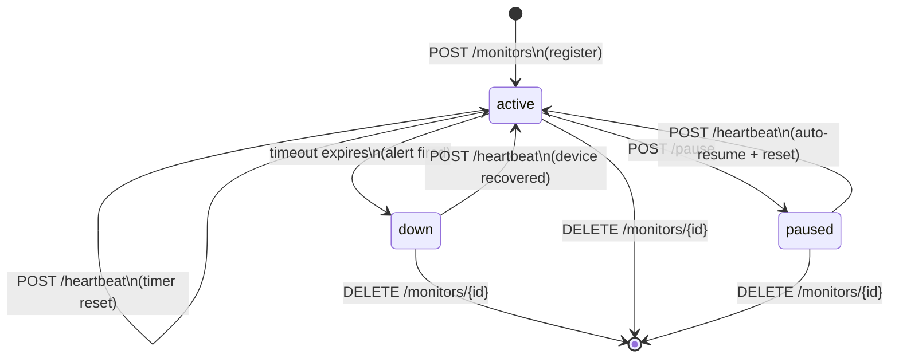
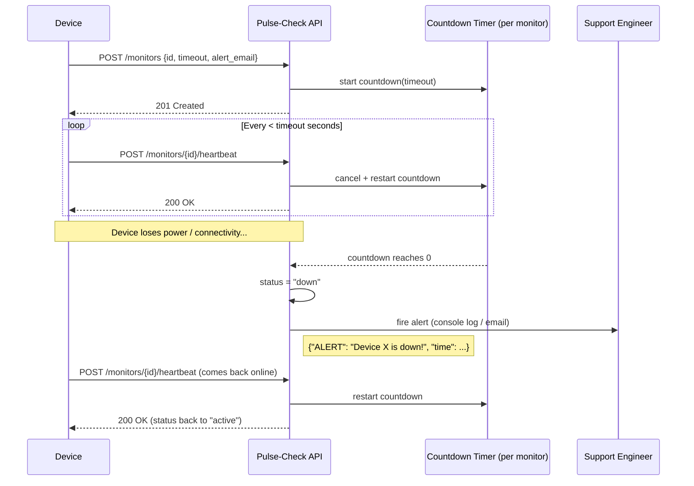

# Pulse-Check API ("Watchdog" Sentinel)

A **Dead Man's Switch API** built for *CritMon Servers Inc.* to monitor remote solar farms and unmanned weather stations. Each device registers a "monitor" with a countdown timer. If the device stops sending heartbeats before the timer expires, the system automatically fires an alert and flips the monitor to `down` — no human has to notice first.

Built with **Python 3.11 + FastAPI**, using per-monitor in-memory countdown timers (`threading.Timer`) guarded by a single lock so heartbeats, pauses, and timeouts can never race each other.

---

## 1. Architecture

### 1.1 State Flowchart

Every monitor moves through exactly three states:



### 1.2 Sequence Diagram — Normal Operation vs. Failure



### 1.3 Component Overview

```
app/
├── main.py     FastAPI app instance + health check
├── routes.py   HTTP endpoints (thin controllers)
├── store.py    MonitorStore: thread-safe state + timers + alert log
└── models.py   Pydantic request/response schemas
```

The `MonitorStore` is the only place that touches timers or shared state. All mutating operations (`create`, `heartbeat`, `pause`, `delete`, and the internal timeout callback) acquire the same `RLock`, so a heartbeat arriving at the exact moment a timer expires can never leave the system in an inconsistent state.

---

## 2. Setup Instructions

**Requirements:** Python 3.10+

```bash
# 1. Clone your fork
git clone <your-fork-url>
cd Pulse-Check-API

# 2. Create a virtual environment
python3 -m venv .venv
source .venv/bin/activate      # Windows: .venv\Scripts\activate

# 3. Install dependencies
pip install -r requirements.txt

# 4. Run the server
python run.py
```

The API is now live at `http://localhost:8000`. Interactive Swagger docs are auto-generated at `http://localhost:8000/docs`.

### Running Tests

```bash
pip install -r requirements-dev.txt
pytest tests/ -v
```

---

## 3. API Documentation

Base URL: `http://localhost:8000`

### `POST /monitors` — Register a monitor

**Request:**
```json
{
  "id": "device-123",
  "timeout": 60,
  "alert_email": "admin@critmon.com"
}
```

**Response `201 Created`:**
```json
{
  "message": "Monitor 'device-123' registered and armed for 60.0s",
  "monitor": {
    "id": "device-123",
    "status": "active",
    "timeout": 60.0,
    "alert_email": "admin@critmon.com",
    "created_at": "2026-07-03T13:00:00Z",
    "last_heartbeat_at": "2026-07-03T13:00:00Z",
    "seconds_remaining": 60.0
  }
}
```

Other responses: `409 Conflict` if `id` is already registered, `422 Unprocessable Entity` for invalid input (non-positive timeout, malformed email, missing fields).

### `POST /monitors/{id}/heartbeat` — Reset the countdown

- Resets the timer back to the full `timeout` window.
- If the monitor was `paused`, it is automatically **un-paused** and rearmed.
- If the monitor was `down`, a heartbeat means the device recovered — it is brought back to `active`.

**Response `200 OK`:**
```json
{
  "message": "Heartbeat received. Timer reset to 60.0s",
  "monitor": { "...": "..." }
}
```

`404 Not Found` if `id` does not exist.

### `POST /monitors/{id}/pause` — Snooze a monitor

Stops the countdown completely — no alert will fire while paused. Calling `heartbeat` again resumes monitoring.

**Response `200 OK`:**
```json
{
  "message": "Monitor 'device-123' paused. No alerts will fire until the next heartbeat",
  "monitor": { "...": "..." }
}
```

`404 Not Found` if `id` does not exist.

### `GET /monitors` — List all monitors

Returns every monitor with a live `seconds_remaining` calculation. Useful for a status dashboard.

### `GET /monitors/{id}` — Get a single monitor

`404 Not Found` if `id` does not exist.

### `DELETE /monitors/{id}` — Deregister a monitor

Cancels the timer and removes the monitor. Returns `204 No Content`.

### `GET /alerts` — Alert history *(Developer's Choice, see below)*

Returns every alert ever fired, oldest first:

```json
[
  {
    "monitor_id": "device-123",
    "alert_email": "admin@critmon.com",
    "message": "Device device-123 is down!",
    "time": "2026-07-03T13:05:00Z"
  }
]
```

### Alert Simulation

When a monitor's timer reaches zero, the system prints a structured alert to the console (simulating an email/webhook) and records it in the alert history:

```
{'ALERT': 'Device device-123 is down!', 'time': '2026-07-03T13:05:00+00:00', 'notify': 'admin@critmon.com'}
```

---

## 4. The Developer's Choice: Alert History Log (`GET /alerts`)

**The gap:** The spec only requires firing an alert at the moment of failure. But a `console.log` is ephemeral — if a support engineer isn't watching the terminal at the exact second a device goes down, that signal is lost forever. In a real incident, "when did this actually start failing, and has it happened before?" is the first question anyone asks.

**What I added:** An in-memory, append-only **alert history log**, exposed via `GET /alerts`. Every triggered alert (device ID, notification target, message, and UTC timestamp) is persisted for the lifetime of the process, independent of the monitor's current status. This means:

- A monitor can be restored to `active` (via heartbeat) without erasing the record that it *did* go down.
- Engineers get a lightweight audit trail / incident timeline for free, without needing an external logging stack.
- It's the natural foundation for future work (pagination, filtering by device, exporting to a real incident-management tool) without changing the alert-firing logic itself.

It's intentionally minimal — no database, no retention policy — because the goal was to demonstrate the *pattern* (separate the act of alerting from the act of remembering that you alerted) rather than build a full observability platform.

---

## 5. Design Notes & Assumptions

- **Timers are in-memory** (`threading.Timer` per monitor). Restarting the process clears all monitors and history — acceptable for this challenge, but a production version would persist state (e.g., Redis with `EXPIRE`) and recompute deadlines on boot.
- **Duplicate registration** (`POST /monitors` with an existing `id`) returns `409 Conflict` rather than silently overwriting an existing monitor, to avoid accidentally resetting someone else's timer.
- **A `down` monitor can be revived** by a heartbeat. The brief doesn't specify this case explicitly, but it's the only behavior that matches the real-world scenario: a device that was offline and comes back should return to being monitored, not stay `down` forever.
- **Validation:** `timeout` must be a positive number and `alert_email` must be a syntactically valid email (enforced via Pydantic), returning `422` on bad input.

---

## 6. Tech Stack

- **Python 3.11**, **FastAPI**, **Uvicorn**
- **Pydantic** for request/response validation
- **pytest** + **httpx** (via FastAPI's `TestClient`) for automated tests covering registration, heartbeats, 404s, pause/resume, timeout-triggered alerts, and input validation
